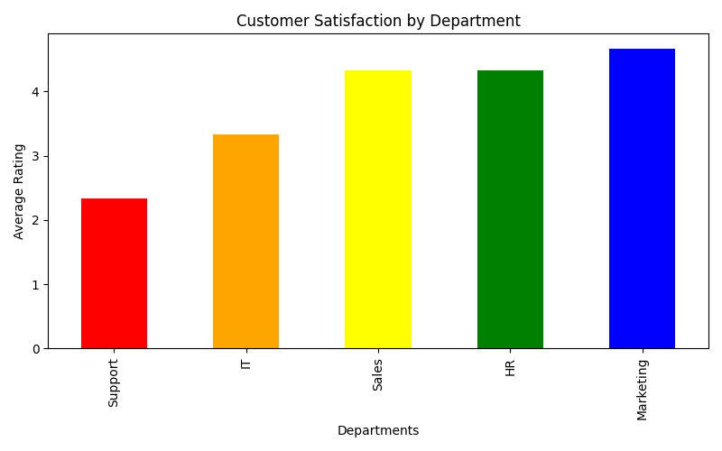

# customer-satisfaction-analysis

Python automation project that analyzes customer feedback data from Excel files and automatically generates charts and PDF reports.

## Technologies
- Python
- Pandas
- Matplotlib
- FPDF

## Features
- Excel data analysis
- Department rating calculation
- Automatic chart generation
- PDF reporting

## Preview

# Author

JG Automation & Data
